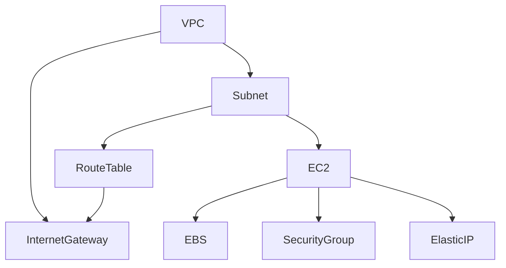

**# AWS EC2 Terraform Deployment

## 🚀 Description

Ce projet Terraform automatise la création d'une infrastructure simple sur AWS comprenant :

- Un VPC personnalisé avec son sous-réseau.
- Une passerelle Internet pour l'accès public.
- Une table de routage configurée.
- Une instance EC2 Ubuntu avec un serveur Nginx installé automatiquement.
- L'attribution d'une adresse IP élastique (EIP).
- Un disque racine EBS personnalisable.
- Un groupe de sécurité permettant SSH, HTTP et HTTPS.

Le déploiement est entièrement paramétrable via un fichier `variables.tf`.

---

## 📂 Fichiers

- **`main.tf`** : contient toute la logique de déploiement de l'infrastructure.
- **`variables.tf`** : définit les variables personnalisables pour l'instance EC2 et le volume EBS.

---

## 📝 Variables disponibles

| Nom         | Type    | Description                                  | Valeur par défaut |
|-------------|---------|----------------------------------------------|--------------------|
| `size`      | number  | Taille du volume EBS root de l'instance (Go) | 10                 |
| `volume`    | string  | Nom à donner au volume root                 | "ec2-volume"       |
| `ec2-name`  | string  | Nom attribué à l'instance EC2              | "ec2-ubuntu"       |

---

## 🔄 Prérequis

- Terraform installé localement
- Un compte AWS avec les bonnes permissions (EC2, VPC, EIP, etc.)
- Une paire de clés SSH AWS existante pour la connexion

---

## ✨ Déploiement

1. Clonez ce répertoire :
```bash
 git clone https://github.com/votre-utilisateur/votre-repo.git
 cd votre-repo
```

2. Initialisez Terraform :
```bash
 terraform init
```

3. Personnalisez les variables si besoin dans `variables.tf` ou via la ligne de commande.

4. Lancez le plan pour vérifier :
```bash
 terraform plan
```

5. Appliquez le déploiement :
```bash
 terraform apply
```

6. Accédez à votre instance EC2 via SSH :
```bash
ssh -i path/to/your/key.pem ubuntu@<IP_ELASTIQUE>
```

---

## 💡 Fonctionnalités supplémentaires

- Installation automatique de **Nginx** via SSH après la création de l'instance.
- Attribution automatique de l'Elastic IP et génération d'un fichier `infos_ec2.txt` contenant l'adresse publique.

---

## 🌍 Architecture du projet


